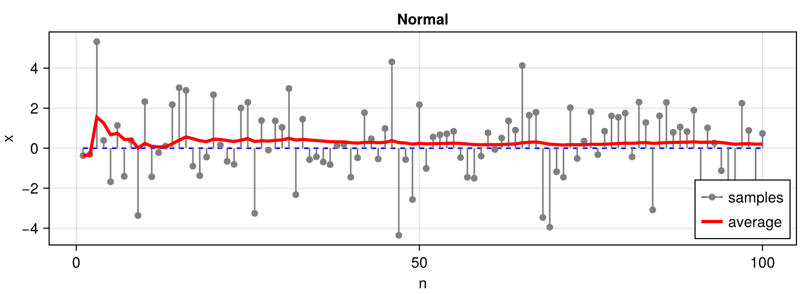
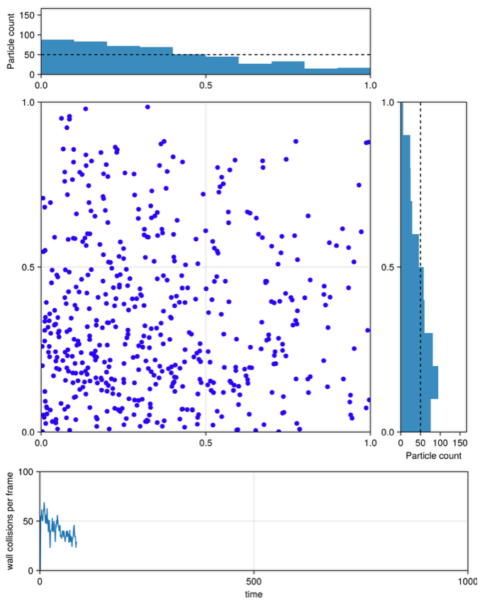
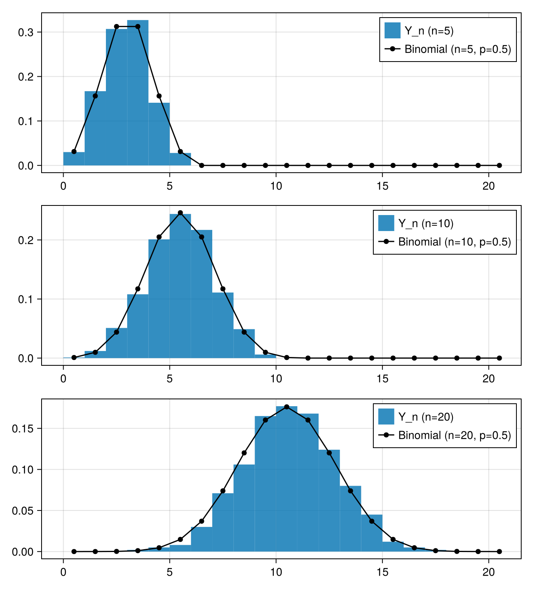
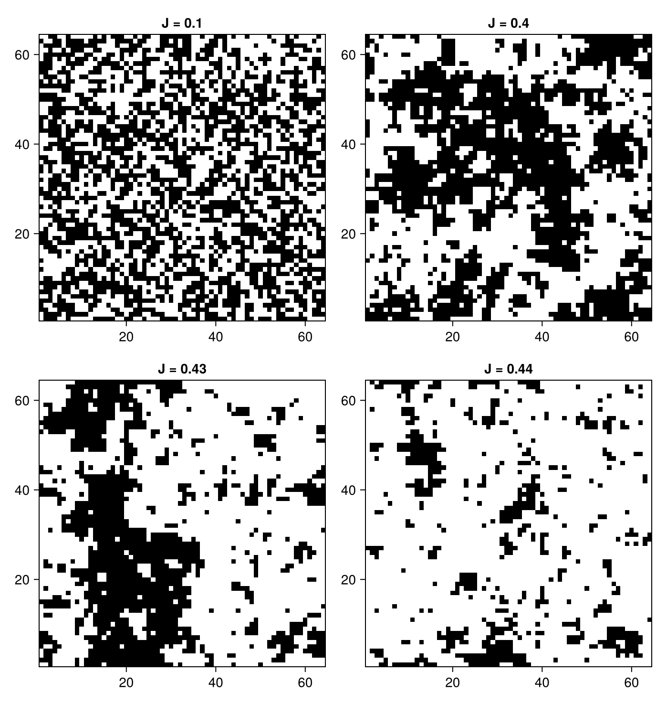
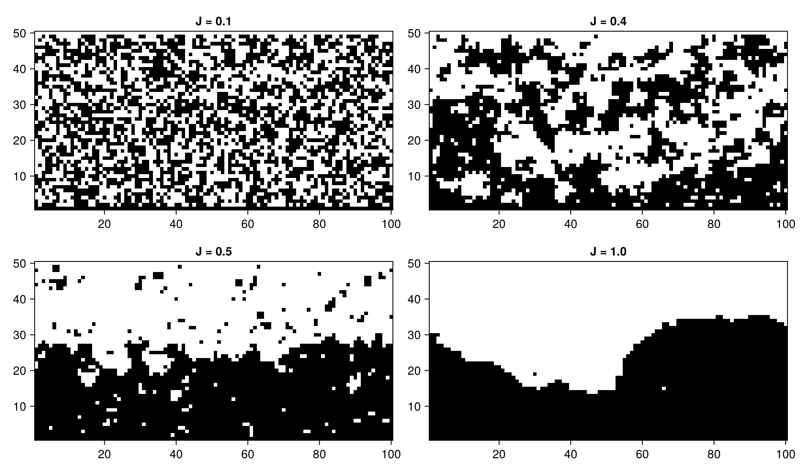
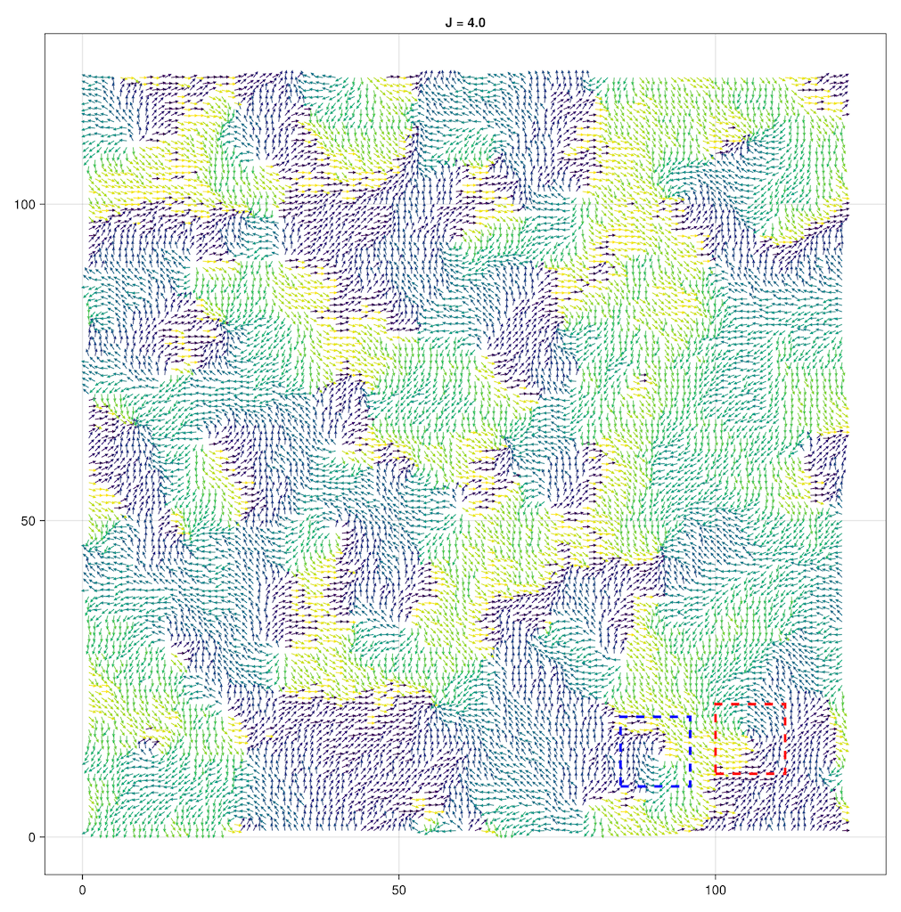
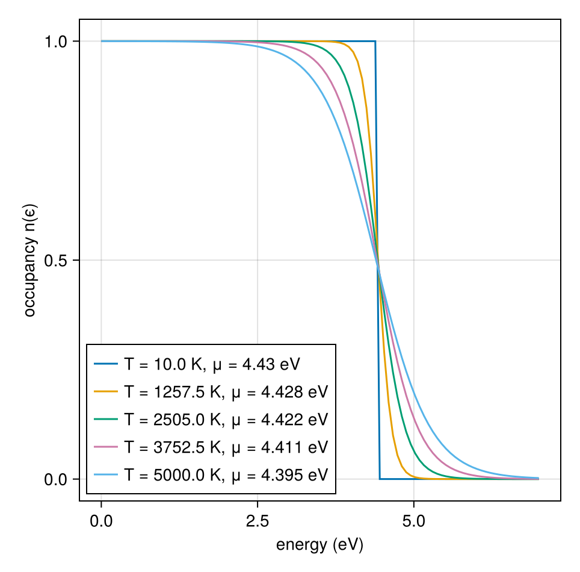
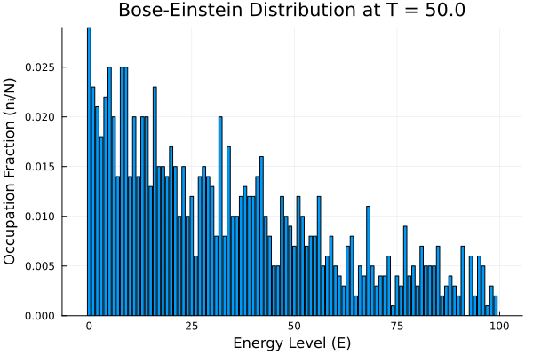

# Computational resources for Statistical Physics course at École Polytechnique

This repository contains computational resources for the Statistical Physics course at École Polytechnique, imparted by Rémi Monasson. Some are external links to resources found on the web illustrating concepts covered in the course, while others are original codes written by authors of this repository. Some original codes are written in Julia (https://julialang.org) and others in Python.

For any questions or suggestions, please contact the author of this repository: [Jorge FERNANDEZ-DE-COSSIO-DIAZ](https://sites.google.com/view/jorgefdcd). Also feel free to open an issue in the repository or a send a pull request if you have any suggestions for improvements.

## Setting up Julia and Pluto

The recommended way to install [Julia](https://julialang.org) is to use the `juliaup` installer. On Unix-type system (Linux, macOS) open a terminal and run the following command:

```bash
curl -fsSL https://install.julialang.org | sh
```

and follow the instructions (you can accept the default settings). If you are using Windows instead, open the command prompt and run the following command:

```bash
winget install --name Julia --id 9NJNWW8PVKMN -e -s msstore
```

This will install the latest version of Julia on your system. Now to open Julia, you can run the following command in the terminal:

```bash
julia
```

Note that right after installing Julia, you may need to close and reopen the terminal for the `julia` command to be recognized. This will open the Julia REPL (Read-Eval-Print Loop), which is an interactive shell for Julia. You can run Julia commands directly in the REPL.

We also use [Pluto](https://plutojl.org) notebooks, which are a Julia package that allows you to create interactive notebooks. To install Pluto, open Julia and run the following command:

```julia
import Pkg
Pkg.add("Pluto")
```

To run a Pluto notebook, open Julia and run the following command:

```julia
using Pluto
Pluto.run()
```

This will open a web browser with the Pluto interface. You can create a new notebook by clicking on the "New notebook" button. You can also open an existing notebook by clicking on the "Open notebook" button and selecting the notebook file.

## Notebooks

The following links point to Pluto notebooks. Clicking on a link will open a web page with a static version of the notebook. To run the notebook interactively in your computer and edit the code, you can click on the "Edit or run this notebook" button in the top right corner of the page. Then click the button where it says "Download this notebook" and save the file in your computer. Finally, open the notebook in Pluto to run it.

### Illustrations of the law of large numbers

The law of large numbers states that as the number of trials increases, the sample mean will converge to the expected value. This is a fundamental concept in probability and statistics.

Notebook: [link](https://filedn.eu/lr2Qp84TxLASgn3j93EDkAJ/StatPhysCompX/Pluto%20static%20HTML/LLN.html).




### Diffusion in a box and the law of large numbers

We simulate a system of independent particles in a box, where each particle performs a random walk. The notebook illustrates how the law of large numbers applies to the diffusion process.

Notebook: [link](https://filedn.eu/lr2Qp84TxLASgn3j93EDkAJ/StatPhysCompX/Pluto%20static%20HTML/LLN-Diffusion.html).



### Illustrations of central limit theorem

Whereas the law of large numbers states that the sample mean converges to the expected value, the central limit theorem gives a more precise description of how the sample mean fluctuates around this expected value as the number of trials increases. Specifically, it states that the sample mean exhibits Gaussian fluctuations around the expected value as the number of trials increases, regardless of the original distribution of the data.

Notebook: [link](https://filedn.eu/lr2Qp84TxLASgn3j93EDkAJ/StatPhysCompX/Pluto%20static%20HTML/CLT.html).



### 2D Ising model

The Ising model is a paradigmatic model in statistical physics that describes ferromagnetism in materials. It consists of a lattice of spins that can take values of +1 or -1, representing the magnetic moments of atoms. The interactions between neighboring spins lead to phase transitions and critical phenomena.

In this notebook, we simulate the 2D Ising model using the Metropolis algorithm, which is a Monte Carlo method for simulating systems in thermal equilibrium. The notebook allows you to visualize the evolution of the system and observe the phase transition as the temperature changes.

Notebook: [link](https://filedn.eu/lr2Qp84TxLASgn3j93EDkAJ/StatPhysCompX/Pluto%20static%20HTML/Ising-Metropolis.html).



### Conserved order parameter Ising model

The conserved order-parameter Ising model is a variant of the Ising model that includes a conserved quantity, such as magnetization. This model is used to study systems with conservation laws, such as spinodal decomposition in binary alloys.

In this notebook, we simulate the conserved order-parameter Ising model using the Kawasaki algorithm, which is a Monte Carlo method that conserves the total magnetization. The notebook allows you to visualize the evolution of the system and observe the dynamics of the conserved order parameter.

Notebook: [link](https://filedn.eu/lr2Qp84TxLASgn3j93EDkAJ/StatPhysCompX/Pluto%20static%20HTML/Kawasaki-COP.html).



### XY model

The XY model is a statistical physics model that describes systems with continuous symmetry, such as superfluid helium or liquid crystals. It consists of a lattice of spins that can take any value on a circle, representing the orientation of the spins.

In this notebook, we simulate the XY model using the Metropolis algorithm.

Notebook: [link](https://filedn.eu/lr2Qp84TxLASgn3j93EDkAJ/StatPhysCompX/Pluto%20static%20HTML/XY.html).



### Ideal Fermi gases of non-interacting fermions

The ideal Fermi gas is a model that describes a system of non-interacting fermions, such as electrons in a metal. It is characterized by the Pauli exclusion principle, which states that no two fermions can occupy the same quantum state.

Notebook: [link](https://filedn.eu/lr2Qp84TxLASgn3j93EDkAJ/StatPhysCompX/Pluto%20static%20HTML/quantum-gasses-fermi.html).



### Bose-Einstein condensation

Bose-Einstein condensation is a phenomenon that occurs in systems of bosons at low temperatures, where a large number of particles occupy the same quantum state. This leads to macroscopic quantum phenomena, such as superfluidity.

In this notebook, we illustrate how to simulate the Bose-Einstein condensation of a system of bosons using a Monte-Carlo algorithm. The simulation allows us to visualize the occupation of the ground state as the temperature changes. We consider a system of non-interacting bosons in a box, where the particles can occupy discrete energy levels. But the Monte-Carlo routines can also be used to simulate more complex systems.

Notebook: [link](https://filedn.eu/lr2Qp84TxLASgn3j93EDkAJ/StatPhysCompX/Pluto%20static%20HTML/bose-einstein-condensation.html).




- Simulation of a simple system of particles interacting via a **Lennard-Jones potential**: [link](https://filedn.eu/lr2Qp84TxLASgn3j93EDkAJ/StatPhysCompX/Pluto%20static%20HTML/lennard-jones.html).

## Other resources in Julia:

- Simulations of the 2D Ising model, using the more advanced cluster Wolff algorithm (which is very efficient at or below the critical temperature): https://github.com/cossio/IsingModels.jl.

## External resources:

- XY model: https://kjslag.github.io/XY/.
- Various simulations from physics: https://phet.colorado.edu/en/simulations/filter?type=html.
- MCMC simulation algorithms applied to various systems: https://github.com/npshub/simulation